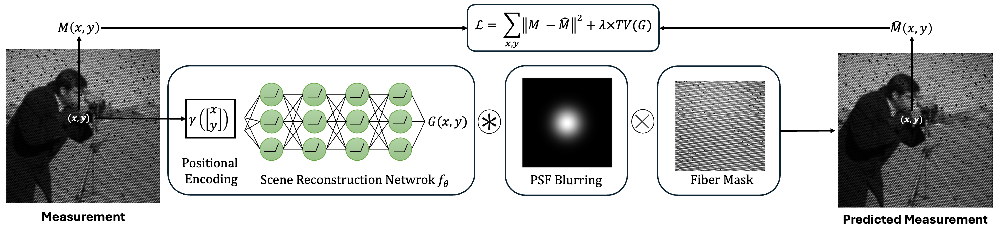
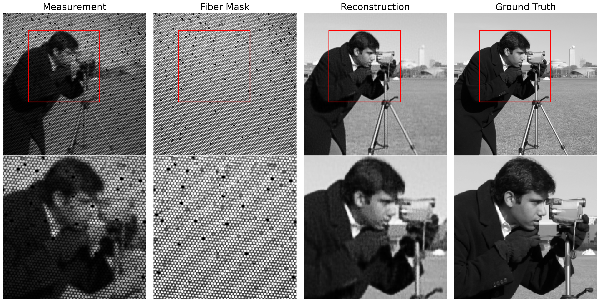

# Neural Fields for Single-Shot Image Reconstruction in Fiber Bundle Imaging Systems
Official code for the paper **"Neural Fields for Single-Shot Image Reconstruction in Fiber Bundle Imaging Systems"** by Amir Reza Vazifeh and Jason W. Fleischer (Princeton University).
## Overview
Fiber bundle imaging (used in endoscopy, optical coherence tomography, and cellular imaging) suffers from resolution loss and honeycomb-like sampling artifacts caused by the discrete arrangement of fiber cores. This repository provides an **unsupervised** method that reconstructs a high-resolution scene from a **single** fiber bundle measurement and a known fiber layout, using an implicit neural representation optimized at test time. 

## Method
Reconstruction is treated as an **inverse problem**. A coordinate-based network $f_\theta$ takes a 2D pixel coordinate $(x, y)$, passed through a positional encoding $\gamma(\cdot)$, and predicts the underlying clean scene intensity:
$$
G(x, y) = f_\theta\left(\gamma(x, y)\right)
$$
The predicted scene $G$ is then passed through a differentiable forward model of the fiber bundle imaging system to simulate what the sensor would have captured:

1. **PSF blurring** — $G$ is convolved with the system's (known or assumed) point-spread function.
2. **Fiber masking** — the blurred image is multiplied element-wise by the known fiber-core mask $F$, simulating the discrete sampling of the fiber bundle.

$$
\hat{M}(x, y) = \left(G * \text{PSF}\right)(x, y) \times F(x, y)
$$

The network is optimized purely at test time (no pretraining) by minimizing the $\ell_2$ error between the simulated measurement $\hat{M}$ and the real observed measurement $M$, plus a total-variation (TV) regularization term on $G$ to control smoothness:

$$
\mathcal{L} = \sum_{x, y} \left\lVert M(x, y) - \hat{M}(x, y) \right\rVert^2 + \lambda \cdot \text{TV}(G)
$$

where:
- $M(x, y)$: observed fiber bundle measurement at pixel $(x, y)$
- $\hat{M}(x, y)$: simulated measurement predicted by the model
- $\lambda$: weight controlling the strength of the TV smoothness regularization

**Note on positional encoding**: To mitigate spectral bias and improve reconstruction of high-frequency details, spatial coordinates are passed through positional encoding $\gamma(\cdot)$ before being mapped to scene intensity by $f_\theta$.

Once optimized, the high-resolution scene can be recovered at arbitrary spatial resolution simply by querying $f_\theta$ at any coordinate $(x, y)$.

<p align="center">
  
</p>

## Results
The method is validated on both **simulated** and **experimental** fiber bundle data.
**Simulated data:** A cameraman image is Gaussian-blurred (σ = 1.5) and passed through a known fiber mask. After 25,000 optimization iterations (λ = 0.001), the reconstruction achieves **PSNR / SSIM of 29.03 dB / 0.81**, an improvement of **+18.65 dB / +0.62** over the raw fiber-masked measurement.
<p align="center">
  
</p>
**Experimental data:** The method is applied to a resolution-chart image captured through a real fiber bundle imaging setup, with the PSF approximated as a Gaussian (σ = 0.5) since the true PSF was unavailable. The effect of the TV regularization weight λ is explored across `{0.001, 0.01, 0.05, 0.1}` — higher λ yields smoother reconstructions, while lower λ retains high-frequency noise and residual honeycomb patterning. **λ = 0.05** gives the sharpest reconstruction without visible fiber artifacts, resolving Group 7 Element 4 versus Group 7 Element 1 in the raw measurement.

> **Attribution:** The resolution chart image in the experimental dataset is sourced from the *PyFibreBundle* repository: https://github.com/MikeHughesKent/PyFibreBundle

<p align="center">
  
</p>
## Repository Structure
```
Neural-Fields-Single-Shot-Fiber-Bundle-Imaging/
├── Code/          # Implementation of the neural field reconstruction method
├── Figures/        # Figures used in the paper (e.g. method overview diagram)
├── Results/       # Simulated and experimental reconstruction results
└── README.md
```
## Contact
For questions or issues, please contact [amir.vazifeh@princeton.edu](mailto:amir.vazifeh@princeton.edu).
## Citation
To be added!
